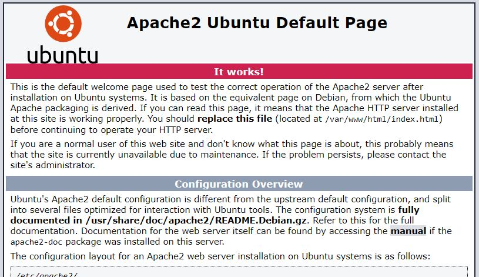
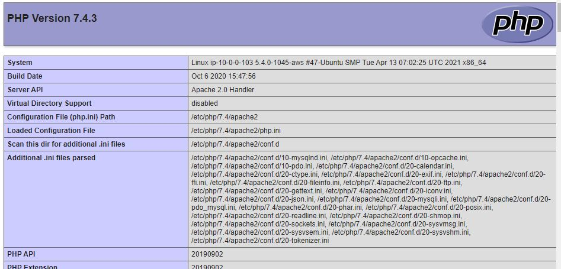

# Project 1

1. I installed Ubuntu 20.0 on AWS EC2 instance

1. Installed Apache2 and tested the ip address

_sudo apt install apache2_ - install apache2\
_sudo systemctl status apache2_ - check the status of the installation\
_curl https://localhhost:80_ - check if the port is open\

1. Installed MySql/php & there connectors

_sudo apt install mysql-server_ - installed MySql
_sudo apt install php libapache2-mod-php php-mysql_ - installed php & connectors
_php -v_ - check the php version

1. Setup a virtual host

_sudo mkdir /var/www/projectlamp_ - make a directory for the domain
_sudo chown -R $USER:$USER /var/www/projectlamp_ - change ownership to current user in shell
_sudo vi /etc/apache2/sites-available/projectlamp.conf_ - create a configuration file for the domain and fille with below to set root source, domain name, etc

'''html
    <VirtualHost *:80>
    ServerName projectlamp
    ServerAlias www.projectlamp 
    ServerAdmin webmaster@localhost
    DocumentRoot /var/www/projectlamp
    ErrorLog ${APACHE_LOG_DIR}/error.log
    CustomLog ${APACHE_LOG_DIR}/access.log combined
    </VirtualHost>
'''
_sudo a2ensite projectlamp_ - enable the virtual host
_sudo a2dissite 000-default_ - disable the default site
_sudo apache2ctl configtest_ - test the configuration
_sudo systemctl reload apache2_ - apache2 must be reloaded after configuration
_sudo echo "<h1> new site </h1>" /var/www/lampproject/index.html - create a test file

1. Enable PHP

_sudo vim /etc/apache2/mods-enabled/dir.conf_ - change the priority of .php to superceed .html
_sudu systemctl reload apache2_ - apache must be reloaded afte the change
_nano /var/www/lampproject/index.php - create the .php file and fill with the code below

'''php
    <?php
    phpinfo();
'''

1[thestack](LAMP.jpg)