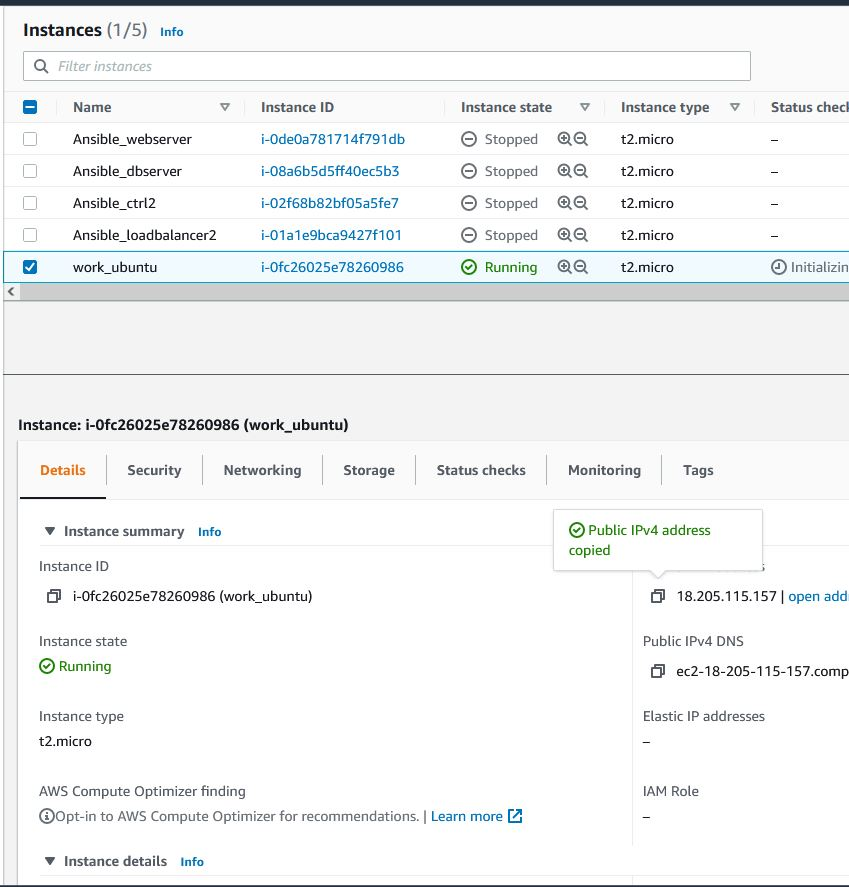

# Project 1

1. I installed Ubuntu 20.0 on AWS EC2 instance

_sudo apt install apache2_ - install apache2\
_sudo systemctl status apache2_ - check the status of the installation\
_curl https://localhhost:80_ - check if the port is open\
