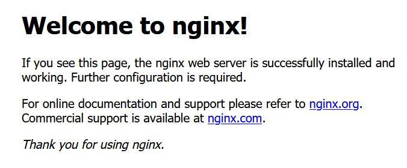
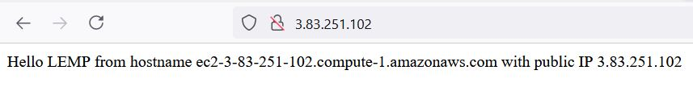
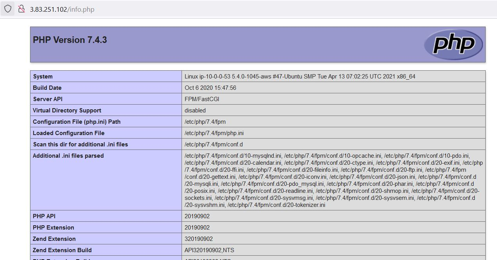
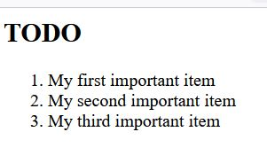
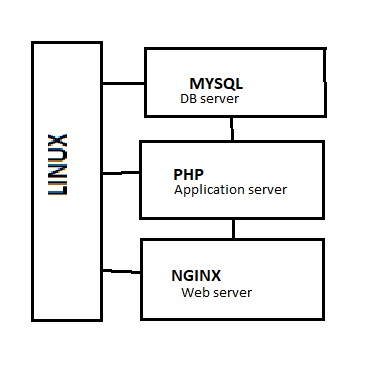

# Project 2

1. Install NGINX

_sudo apt update_ - **update the repo**\
_sudo apt upgrade_ - **upgrade to latest versions**\
_sudo apt install nginx_ - **install NGINX**\
_curl http://localhost:80_ - **test the webserver**



2. Install MySQL

_sudo apt install mysql-server_ - install mysql\
_sudo mysql\_secure\_installation_ - run native installation security tool\
_sudo mysql_ - test mysql

3. Install PHP

_sudo apt install php-mysql php-fpm_ - install php, php-mysql connector, php-nginx connector

4. Connect NGINX to PHP

_sudo mkdir /var/www/lempproject_ - make a dorectory to hold website\
_sudo chown -R $USER:$USER /var/www/lempproject_ - change ownership of the file\
_sudo nano /etc/nginx/site-avaialable/lempproject_ - make config file and fill as below

```shell
    \#/etc/nginx/sites-available/projectLEMP

server {
    listen 80;
    server_name projectLEMP www.projectLEMP;
    root /var/www/projectLEMP;

    index index.html index.htm index.php;

    location / {
        try_files $uri $uri/ =404;
    }

    location ~ \.php$ {
        include snippets/fastcgi-php.conf;
        fastcgi_pass unix:/var/run/php/php7.4-fpm.sock;
     }

    location ~ /\.ht {
        deny all;
    }

}
```
_sudo ln -s /etc/nginx/sites-available/lempproject /etc/nginx/sites-enabled/_ - make symbolic link to the configuration\
_sudo nginx -t_ - test the syntax of the configuration\
_sudo unlink /etc/nginx/sites-enabled/default_ - unlink the default host listening on port 80\
_sudo echo "some data" >> /var/www/lempproject/index.html_ - create test page\
_curl http://localhost:80_ - test the site



5. test the PHP on NGINX

_sudo nano /var/www/lempproject/info.php_ - create a php file and fill as below

```php
    <?php
    phpinfo()>
```

Visit the site on the browser with http://ip-address/info.php



1. retrieve data from MySQL with PHP

_sudo mysql_ - enter mysql with root user\
_CREATE DATABASE db\_name;_ - create a new database\
_CREATE USER 'username'@'%' IDENTIFIED WITH mysql\_native\_password BY 'password';_ - create user\
_GRANT ALL ON 'db\_name.*' TO username'@'%';_ - grant access to the db for user

Exit MySQL and login with the new user credentials

_mysql -u username -p password_ - login\
_SHOW databases;_ - show databases\
_CREATE TABLE db\_name.table\_name (column1 type, column2 type);_ - create table\
_INSERT INTO db\_name.table\_name (column1, column2) VALUES ('value1', 'value2');_ - insert values

Exit MySQL

_sudo mkdir /var/www/lempproject/todo\list.php_ make a directory for the db connection test file and fill with:

```php
   <?php
$user = "example_user";
$password = "password";
$database = "example_database";
$table = "todo_list";

try {
  $db = new PDO("mysql:host=localhost;dbname=$database", $user, $password);
  echo "<h2>TODO</h2><ol>";
  foreach($db->query("SELECT content FROM $table") as $row) {
    echo "<li>" . $row['content'] . "</li>";
  }
  echo "</ol>";
} catch (PDOException $e) {
    print "Error!: " . $e->getMessage() . "<br/>";
    die();
} 
```

Test the connection via the ip/todo_list.php



### Architecture

