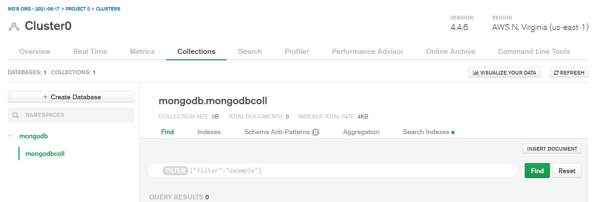
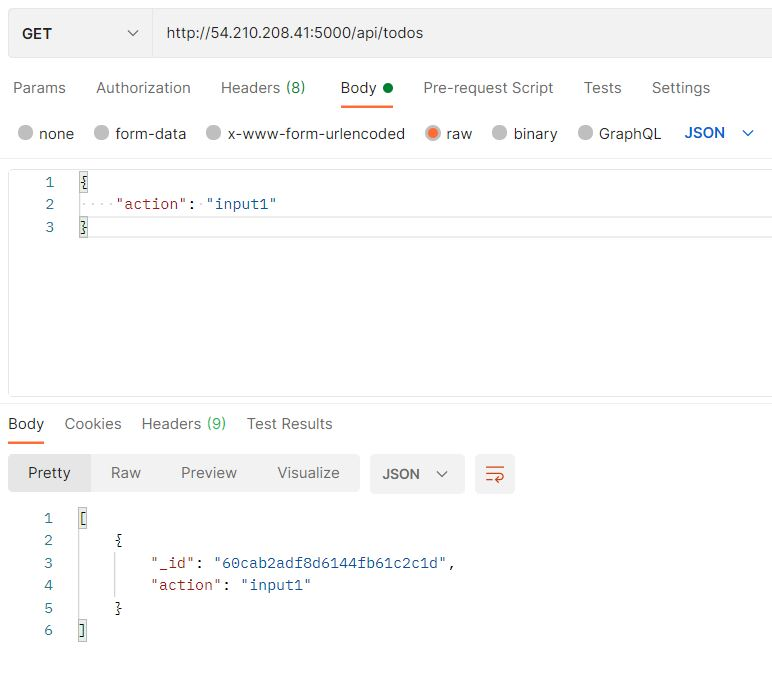
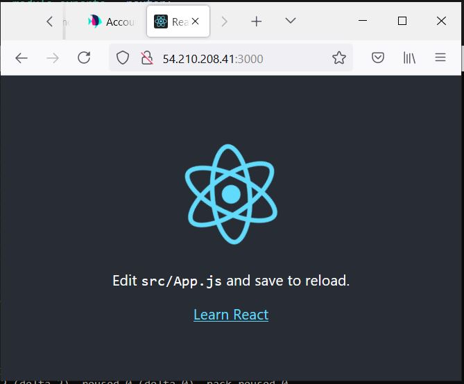
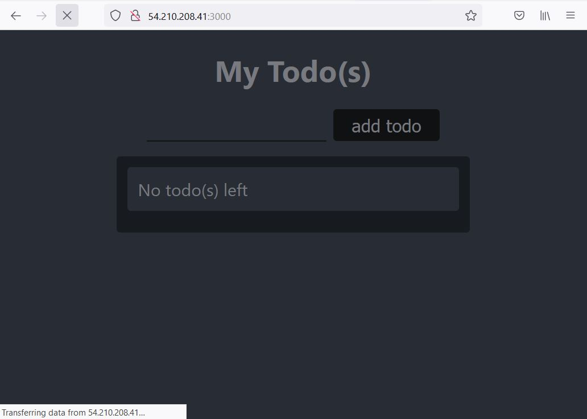

# Project 3

1. Install NodeJS


_sudo apt update_ - update ubuntu\
_sudo apt upgrade_ - upgrade ubuntu\
_curl -sL https://deb.nodesource.com/setup_12.x | sudo -E bash -_ - get the location\
_sudo apt install -y nodejs_ - install nodejs\
_mkdir todo_ - make a directory for the todo application\
_npm init_ - initialize the project inside the folder

2. Install ReactJS


_npm install express_ - install expressJS\
_npm install dotenv_ - install dotenv module(environmental variable manager)\
_touch index.js_ - create the index file and add the below code

```javascript
const express = require('express');
require('dotenv').config();

const app = express();

const port = process.env.PORT || 5000;

app.use((req, res, next) => {
res.header("Access-Control-Allow-Origin", "\*");
res.header("Access-Control-Allow-Headers", "Origin, X-Requested-With, Content-Type, Accept");
next();
});

app.use((req, res, next) => {
res.send('Welcome to Express');
});

app.listen(port, () => {
console.log(`Server running on port ${port}`)
});
```

_node index.js_ - test the server

##### NodeJS server running


##### ReactJS serving


3. Configure routes

#### Routes handle HTTP API requests between end points

_mkdir todo/routes_ - make the routes directory\
_nano todo/routes/api.js_ - create an API file and enter the below

```javascript
const express = require ('express');
const router = express.Router();

router.get('/todos', (req, res, next) => {

});

router.post('/todos', (req, res, next) => {

});

router.delete('/todos/:id', (req, res, next) => {

})

module.exports = router;
```

4. Make the Models

#### Models is the schema for the database

_npm install mongoose_ - install mongoose, a module making it easier for nodeJS to connect to MongoDB\
_nkdir models_ - make the models directory and enter it\
_nano todo.js_ - create a todo.js file


5. Return to edit the routes

change to the routes folder and edit the api.js file to update the routes/code to the new model as below

```javascript
    const express = require ('express');
const router = express.Router();
const Todo = require('../models/todo');

router.get('/todos', (req, res, next) => {

//this will return all the data, exposing only the id and action field to the client
Todo.find({}, 'action')
.then(data => res.json(data))
.catch(next)
});

router.post('/todos', (req, res, next) => {
if(req.body.action){
Todo.create(req.body)
.then(data => res.json(data))
.catch(next)
}else {
res.json({
error: "The input field is empty"
})
}
});

router.delete('/todos/:id', (req, res, next) => {
Todo.findOneAndDelete({"_id": req.params.id})
.then(data => res.json(data))
.catch(next)
})

module.exports = router;
```

5. Create a nosql database
   
#### create the mongoDB on ATLAS mongodb web application


6. Test the API

#### Test the APIs on postman


7. Run the react app

_npx create-react-app client_ - install react\
_npm install nodemon --save-dev_ - helps with server monitoring and maintenance\
_npm install concurrently --save-dev_ - used to run multiple commands in the same window

#### edit the package.json "scripts" key with below

```json
    "scripts": {
    "start": "node index.js",
    "start-watch": "nodemon index.js",
    "dev": "concurrently \"npm run start-watch\" \"cd client && npm start\""
},
```

#### cd into the client new folder

_nano package.json_ - edit the file to add "proxy": "http://localhost:5000"\
_npm run dev_ - run the dev build of react from todo folder

#### test the server on localhost:3000


8. create react components(reusable modular code)

_mkdir /client/src/components_ - create the components folder\
_touch Input.js ListTodo.js Todo.js_ - create the component files\
_nano Input.js_ - edit the component file with the required code\
_npm install axios_ - install axios(HTTP client for browser-nodeJS) in client folder\
_nano ListTodo.js_ - edit the component file with the required code\
_nano Todo.js_ - edit the component file with the required code

#### edit the app.js & app.css & index.css in src with new code


