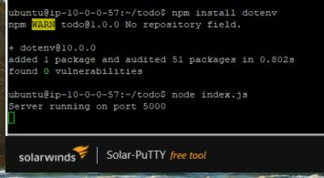
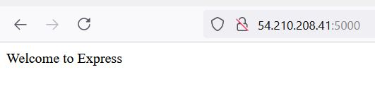

# Project 3

1. Install NodeJS


_sudo apt update_ - update ubuntu
_sudo apt upgrade_ - upgrade ubuntu
_curl -sL https://deb.nodesource.com/setup_12.x | sudo -E bash -_ - get the location
_sudo apt install -y nodejs_ - install nodejs
_mkdir todo_ - make a directory for the todo application
_npm init_ - initialize the project inside the folder
_npm install express_ - install expressJS
_npm install dotenv_ - install dotenv module(environmental variable manager)
_touch index.js_ - create the index file and add the below code

```javascript
const express = require('express');
require('dotenv').config();

const app = express();

const port = process.env.PORT || 5000;

app.use((req, res, next) => {
res.header("Access-Control-Allow-Origin", "\*");
res.header("Access-Control-Allow-Headers", "Origin, X-Requested-With, Content-Type, Accept");
next();
});

app.use((req, res, next) => {
res.send('Welcome to Express');
});

app.listen(port, () => {
console.log(`Server running on port ${port}`)
});
```

_node index.js_ - test the server

##### NodeJS server running


##### ReactJS serving



